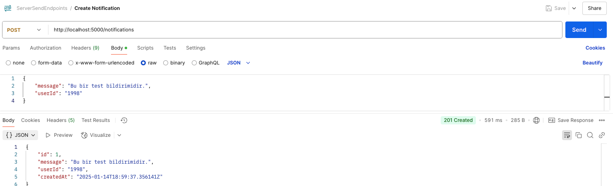
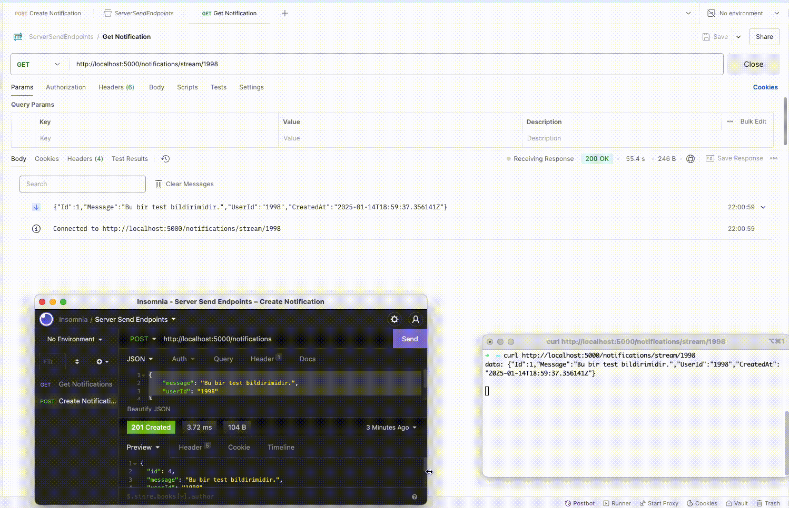

# Server-Sent Events (SSE)

## **Server-Sent Events (SSE) Nedir?**
Server-Sent Events (SSE), **HTTP üzerinden sunucudan istemciye sürekli veri akışı** sağlayan bir teknolojidir. İstemci, sunucudan gelen verileri gerçek zamanlı olarak alabilir. Bu, özellikle canlı bildirimler, durum güncellemeleri, canlı skorlar gibi uygulamalar için kullanışlıdır.

SSE, HTTP protokolüne dayalıdır ve iletişim formatı olarak `text/event-stream` kullanır. Tarayıcılar yerleşik olarak SSE'yi destekler ve istemci tarafında JavaScript kullanılarak kolayca kullanılabilir.

---

## **Server-Sent Events ve WebSocket'in Farkları**
| Özellik                  | Server-Sent Events (SSE)           | WebSocket                       |
|--------------------------|------------------------------------|---------------------------------|
| **Protokol**             | HTTP                              | TCP (HTTP üzerinden yükseltilir) |
| **İletişim Yönü**        | Tek yönlü (Sunucudan istemciye)    | Çift yönlü (Sunucu <--> İstemci) |
| **Karmaşıklık**          | Basit                             | Daha karmaşık                   |
| **Tarayıcı Desteği**     | Yerleşik API                      | Kütüphane veya manuel yönetim   |
| **Yeniden Bağlantı**     | Otomatik                          | Manuel veya özel yapılandırma   |
| **Kullanım Alanları**    | Bildirimler, canlı güncellemeler   | Sohbet, oyunlar, etkileşimli uygulamalar |

---

## **SSE'nin Avantajları**
1. **Basitlik:** HTTP protokolü üzerine kurulu olduğundan uygulaması kolaydır.
2. **Yerleşik Destek:** Modern tarayıcılar tarafından doğrudan desteklenir.
3. **Otomatik Yeniden Bağlantı:** İstemci bağlantısı kesilirse tarayıcı otomatik olarak yeniden bağlanmaya çalışır.
4. **Hafiflik:** Tek yönlü iletişim gerektiğinde daha az kaynak tüketir.
5. **HTTP Tabanlı Çalışma:** Proxy'ler ve güvenlik duvarları ile uyumludur.

---

## **Server-Sent Events (SSE) ile Notification Örneği**
Bu proje, **Server-Sent Events (SSE)** kullanılarak kullanıcıya özel bildirimlerin gerçek zamanlı olarak sunulmasını sağlamaktadır. Bildirimler bir **In-Memory Database** üzerinde saklanır ve istemciler `UserId`'ye göre bildirim akışını dinleyebilir.

**Not:** Projenizi genişletmek için JWT tabanlı kimlik doğrulama ekleyebilir veya daha kalıcı bir veritabanı (örneğin, PostgreSQL) kullanabilirsiniz.

### **Özellikler**
- Kullanıcıya özel bildirimler (`UserId` ile filtreleme).
- Gerçek zamanlı bildirim akışı (SSE ile).
- In-Memory Database kullanımı.

---
## **Code Structure**

## 1-) Notification Sınıfı
`Notification` sınıfı, bildirimlerin temel özelliklerini tanımlayan bir modeldir:

```csharp
public class Notification
{
    public int Id { get; set; }
    public string Message { get; set; }
    public string UserId { get; set; }
    public DateTime CreatedAt { get; set; }
}
```

### **2. NotificationDbContext**
`NotificationDbContext`, In-Memory Database ile bildirimlerin yönetimini sağlayan bir veri bağlamıdır:

```csharp
using Microsoft.EntityFrameworkCore;
using NotificationSSEExample.Models;

public class NotificationDbContext : DbContext
{
    public NotificationDbContext(DbContextOptions<NotificationDbContext> options) : base(options) { }

    // Bildirimlerin saklanacağı veri tablosu
    public DbSet<Notification> Notifications { get; set; }
}
```

---

### **3. Program.cs**
Aşağıdaki kod, bildirim oluşturma ve Server-Sent Events (SSE) ile gerçek zamanlı bildirim akışını sağlayan ana uygulama dosyasıdır:


```csharp
var builder = WebApplication.CreateBuilder(args);

// In-Memory Database'i ekle
builder.Services.AddDbContext<NotificationDbContext>(options =>
    options.UseInMemoryDatabase("Notifications"));

var app = builder.Build();

// Bildirim ekleme endpoint'i
app.MapPost("/notifications", async (NotificationDbContext db, Notification notification) =>
{
    notification.CreatedAt = DateTime.UtcNow;
    db.Notifications.Add(notification);
    await db.SaveChangesAsync();
    return Results.Created($"/notifications/{notification.Id}", notification);
});

// SSE ile kullanıcıya özel bildirimleri yayınlama endpoint'i
app.MapGet("/notifications/stream/{userId}", async (HttpContext context, NotificationDbContext db, string userId) =>
{
    context.Response.Headers.Add("Content-Type", "text/event-stream");

    var lastNotificationId = 0;

    while (!context.RequestAborted.IsCancellationRequested)
    {
        var newNotifications = await db.Notifications
            .Where(n => n.UserId == userId && n.Id > lastNotificationId)
            .ToListAsync();

        if (newNotifications.Any())
        {
            foreach (var notification in newNotifications)
            {
                await context.Response.WriteAsync(
                    $"data: {System.Text.Json.JsonSerializer.Serialize(notification)}\n\n");
                await context.Response.Body.FlushAsync();
                lastNotificationId = notification.Id;
            }
        }

        await Task.Delay(1000); // 1 saniye bekle
    }
});

app.Run();
```

---

### **Kullanım**

#### **1. Bildirim Ekleme (POST /notifications)**
Yeni bir bildirim eklemek için şu şekilde bir POST isteği yapılır:

```json
POST http://localhost:5000/notifications
Content-Type: application/json

{
    "message": "Yeni bir bildirim var!",
    "userId": "1998"
}
```



#### **2. Servis Nasıl Çağrılır? (GET /notifications/stream/{userId})**
Bildirimleri dinlemek için şu şekilde bir GET isteği yapılır:

##### **cURL ile Örnek Kullanım:**
```bash
curl http://localhost:5000/notifications/stream/1998
```
